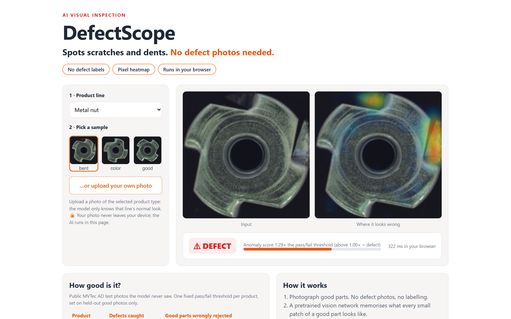
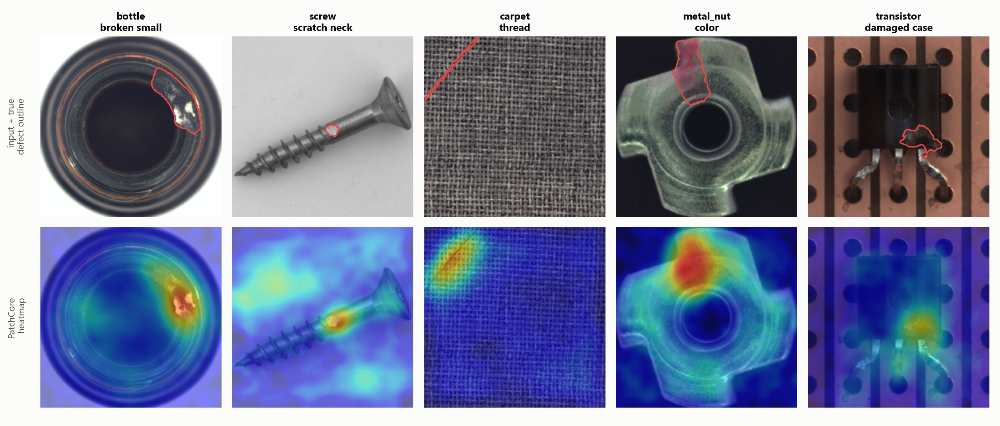

# DefectScope

**Spots scratches and dents. No defect photos needed.**

DefectScope is AI visual inspection set up from photos of *good* parts only. It learns what a normal
part looks like and flags anything that doesn't match, with a heatmap showing exactly where.

**[▶ Try the live demo](https://priyanshu-singh-git.github.io/defectscope/)**. It runs entirely in your
browser, so your photos never leave your device.



## Results in plain numbers

Demo model (ResNet-18, 1% memory bank). Measured on the public [MVTec AD](https://www.mvtec.com/company/research/datasets/mvtec-ad)
test photos the model never saw, with one fixed pass/fail threshold per product. The threshold
is set on held-out *good* photos only, never tuned on the test set.

| Product | Defective parts caught | Good parts wrongly rejected |
|---|---|---|
| Bottle | 98% (62 of 63) | 0% (0 of 20) |
| Screw | 76% (90 of 119) | 0% (0 of 41) |
| Carpet | 99% (88 of 89) | 25% (7 of 28) |
| Metal nut | 98% (91 of 93) | 5% (1 of 22) |
| Transistor | 100% (40 of 40) | 3% (2 of 60) |
| **Average** | **94%** | **7%** |

**Speed:** 50 ms per part on 2 CPU threads (≈1,200 parts/min, no GPU), or about 150 ms inside a web browser.

Screw (tiny thread defects) and carpet (where the threshold is too strict on this split) are the weak
spots. On a real line, both get tuned on the client's own parts before deployment.



*For each product, the defective test photo with the **median** score. Red outline = ground-truth defect.*

## How it works

1. **Photos of good parts.** No defect photos, no labelling.
2. **It learns "normal".** A frozen pretrained CNN turns every small patch of every good photo into a
   feature vector, and a greedy coreset keeps a compact memory bank of them.
3. **It flags anything else.** Each patch of a new photo is compared with its nearest normal patch. The
   distance is the heatmap, and the largest distance is the image score, compared with the threshold.

This is a from-scratch re-implementation of **PatchCore**
([Roth et al., CVPR 2022](https://arxiv.org/abs/2106.08265)) in PyTorch + timm.

## For engineers: benchmark

All numbers are measured and logged in [`eval/runs/`](eval/runs). The full report, including the layer and
coreset ablations, is in **[eval/results.md](eval/results.md)**.

**Backbones** (mean over bottle, screw, carpet, metal nut and transistor; 10% coreset):

| Backbone | Image AUROC | Pixel AUROC |
|---|---|---|
| WideResNet-50 | **0.990** | **0.984** |
| ResNet-18 | 0.989 | 0.982 |
| ConvNeXt-Tiny | 0.980 | 0.974 |
| DINOv2 ViT-S/14 | 0.959 | 0.959 |

**Versus published reference implementations** on the same 5 categories
(Intel [anomalib v1.2.0](https://github.com/open-edge-platform/anomalib/tree/v1.2.0/src/anomalib/models/image) model benchmarks):

| Method | Image AUROC | Pixel AUROC | Screw (image) |
|---|---|---|---|
| **DefectScope, WideResNet-50** | **0.990** | 0.984 | **0.969** |
| **DefectScope, ResNet-18** | 0.989 | 0.982 | 0.963 |
| anomalib PatchCore, WideResNet-50 | 0.988 | **0.986** | 0.960 |
| anomalib PatchCore, ResNet-18 | 0.980 | 0.984 | 0.943 |
| anomalib PaDiM, WideResNet-50 | 0.961 | 0.984 | 0.845 |

Findings:
- **Mid-level features matter.** Layers 2+3 score 0.990; deeper layers 3+4 (more ImageNet-specific) drop to 0.852.
- **The newest backbone isn't the best here.** DINOv2's coarser 16×16 patch grid misses small screw defects (0.811),
  though it is the best on carpet texture (0.998).
- **Memory is cheap to cut.** Keeping 1% of the patches instead of 10% makes the bank 10× smaller (4 MB vs 40 MB for
  WideResNet-50) and costs only 0.004 image AUROC.

Single run per configuration (seed 0), 224×224 centre crop. PRO/AUPRO and the other 10 MVTec categories were not measured.

## Run it yourself

```bash
pip install -r requirements-dev.txt
python -c "from huggingface_hub import snapshot_download as d; d('foersben/mvtec-ad', repo_type='dataset', local_dir='data/mvtec', allow_patterns=[c + '/*' for c in ['bottle','screw','carpet','metal_nut','transistor']])"
pytest -q tests                                              # unit tests
bash eval/run_all.sh                                         # full benchmark grid (GPU recommended)
python eval/make_report.py                                   # eval/results.md + figures
python train/build_demo_banks.py --coreset 0.01 --out models/web --results eval/web_threshold_results.json
streamlit run app/streamlit_app.py                           # local app
python deploy/export_web.py                                  # ONNX + browser demo in docs/ (parity-checked)
```

| Path | What |
|---|---|
| `src/defectscope/` | PatchCore: backbones, patch embedding, greedy coreset, kNN scoring |
| `eval/` | benchmark runner, report generator, logged results |
| `train/` | demo memory banks with held-out thresholds |
| `app/` | Streamlit app (self-host: `deploy/Dockerfile`) |
| `docs/` | browser demo (ONNX Runtime Web), served by GitHub Pages |
| `presentation/` | deck builder (`deck.pptx`, slide PNGs, PDF) |

## Licence and data

Code: [PolyForm Noncommercial 1.0.0](LICENSE). Free for learning, research and personal use. For commercial use,
contact me for a commercial licence.

Demo data: MVTec AD, [CC BY-NC-SA 4.0](https://creativecommons.org/licenses/by-nc-sa/4.0/) (non-commercial).
Client systems are set up on the client's own parts.

---

**Want this on your production line?** Send me photos of your parts and I'll show you whether it works.
Built by **Priyanshu Singh**, freelance AI / ML engineer · [GitHub](https://github.com/Priyanshu-Singh-git)
