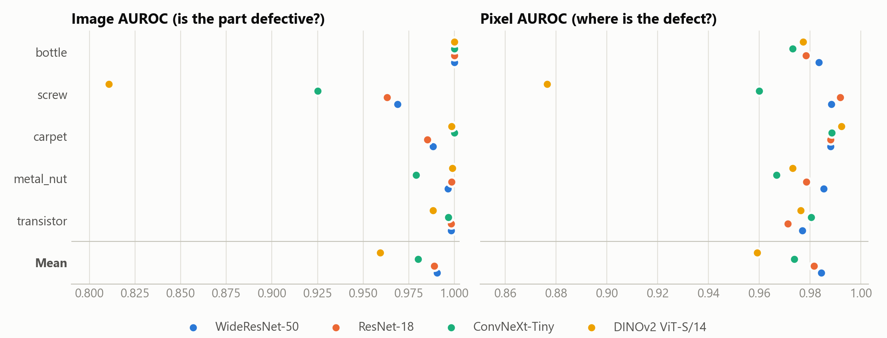
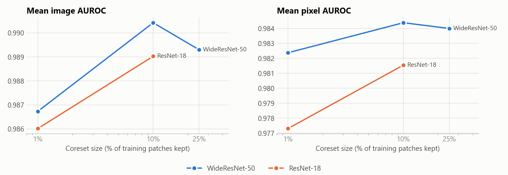

# DefectScope: evaluation results
All numbers are measured by `eval/run_benchmark.py` on the official MVTec AD test split (5 of 15 categories: bottle, screw, carpet, metal_nut, transistor). Images are resized to 256 and center-cropped to 224. Generated by `eval/make_report.py` from `eval/runs/*.jsonl`. All numbers are generated from the logged runs.
Not measured: PRO / AUPRO (region-overlap metric) and the other 10 MVTec categories.
## 1. Backbone comparison (layers: default mid-level pair, coreset 10%)

| Backbone | Layers | bottle | screw | carpet | metal_nut | transistor | **Mean** |
|---|---|---|---|---|---|---|---|
| *Image AUROC* | |  |  |  |  |  |  |
| WideResNet-50 | layer2+layer3 | 1.000 | 0.969 | 0.988 | 0.997 | 0.998 | **0.990** |
| ResNet-18 | layer2+layer3 | 1.000 | 0.963 | 0.985 | 0.999 | 0.998 | **0.989** |
| ConvNeXt-Tiny | stage1+stage2 | 1.000 | 0.925 | 1.000 | 0.979 | 0.997 | **0.980** |
| DINOv2 ViT-S/14 | block7+block10 | 1.000 | 0.811 | 0.998 | 0.999 | 0.988 | **0.959** |
| *Pixel AUROC* | |  |  |  |  |  |  |
| WideResNet-50 | layer2+layer3 | 0.983 | 0.988 | 0.988 | 0.985 | 0.977 | **0.984** |
| ResNet-18 | layer2+layer3 | 0.978 | 0.992 | 0.988 | 0.978 | 0.971 | **0.982** |
| ConvNeXt-Tiny | stage1+stage2 | 0.973 | 0.960 | 0.988 | 0.967 | 0.980 | **0.974** |
| DINOv2 ViT-S/14 | block7+block10 | 0.977 | 0.877 | 0.992 | 0.973 | 0.976 | **0.959** |

| Backbone | Feature dim | Mean bank size (patches) | Mean fit time (s) | GPU ms / test image |
|---|---|---|---|---|
| WideResNet-50 | 1024 | 19,474 | 81.9 | 142.1 |
| ResNet-18 | 384 | 19,474 | 89.7 | 185.4 |
| ConvNeXt-Tiny | 576 | 19,474 | 85.9 | 141.2 |
| DINOv2 ViT-S/14 | 768 | 6,359 | 23.2 | 118.0 |

GPU timings: NVIDIA GeForce RTX 3050 Laptop GPU; per-image time includes data loading, feature extraction, nearest-neighbour search and heatmap upsampling.

## 2. Which layers? (WideResNet-50, coreset 10%)

| Layers | Image AUROC (mean) | Pixel AUROC (mean) | Worst category (image) |
|---|---|---|---|
| layer2 | 0.986 | 0.973 | screw (0.972) |
| layer3 | 0.975 | 0.973 | screw (0.893) |
| layer2+layer3 | 0.990 | 0.984 | screw (0.969) |
| layer3+layer4 | 0.852 | 0.913 | screw (0.667) |

## 3. Coreset size: accuracy vs memory vs speed

| Backbone | Coreset | Image AUROC | Pixel AUROC | Bank size (patches) | Bank size fp16 (MB) | GPU ms / image |
|---|---|---|---|---|---|---|
| WideResNet-50 | 1% | 0.987 | 0.982 | 1,947 | 4.0 | 122.4 |
| WideResNet-50 | 10% | 0.990 | 0.984 | 19,474 | 39.9 | 142.1 |
| WideResNet-50 | 25% | 0.989 | 0.984 | 48,686 | 99.7 | 168.2 |
| ResNet-18 | 1% | 0.986 | 0.977 | 1,947 | 1.5 | 111.4 |
| ResNet-18 | 10% | 0.989 | 0.982 | 19,474 | 15.0 | 185.4 |

## 4. Heatmap gallery (WideResNet-50)

For each category the defective test image with the **median** anomaly score is shown (representative, not the best case). Red outline = ground-truth defect mask.

## 5. Deployed demo model (ResNet-18, coreset 10%, CPU)

Pass/fail threshold = the highest score among 10% of *good training images held out from the memory bank*. No test images were used to pick it. Metrics below are on the full MVTec AD test split at that fixed threshold.

| Category | Test images (defective) | Image AUROC | Accuracy | Defects caught | False alarms on good parts |
|---|---|---|---|---|---|
| bottle | 83 (63) | 1.000 | 98.8% | 98.4% | 0.0% |
| screw | 160 (119) | 0.953 | 83.1% | 79.0% | 4.9% |
| carpet | 117 (89) | 0.986 | 88.9% | 98.9% | 42.9% |
| metal_nut | 115 (93) | 0.997 | 96.5% | 100.0% | 18.2% |
| transistor | 100 (40) | 1.000 | 94.0% | 100.0% | 10.0% |

CPU latency (AMD64 Family 25 Model 80 Stepping 0, AuthenticAMD, 2 threads, 30 images, after warm-up): median **191 ms**, p90 215 ms per image (backbone + nearest-neighbour search + heatmap).
